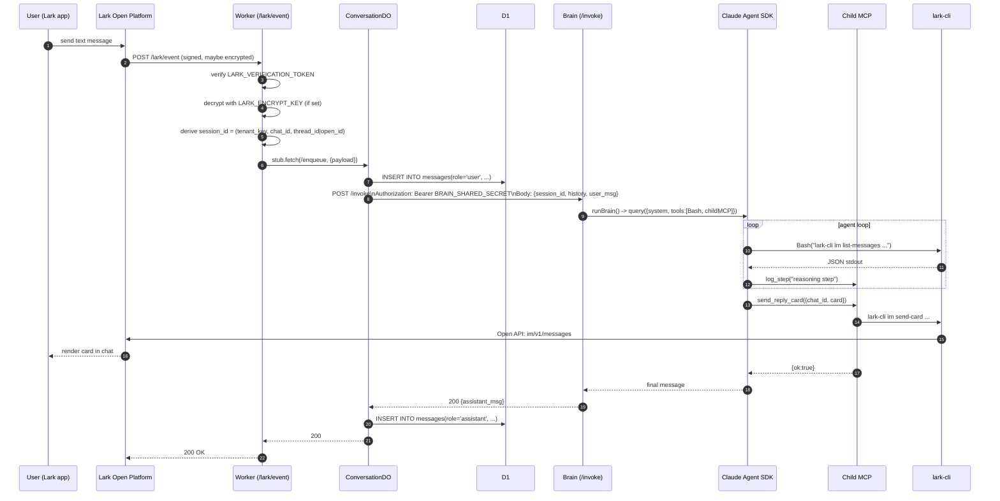

# Sequence: Phone → Lark Bot → Card Reply

This document walks through a single turn on the cloud path: a user types a
message to the Lark bot on their phone, and a reply card comes back. For the
static architecture, see `docs/architecture/overview.md`.

## Actors

- **User / Lark client** — phone app
- **Lark Open Platform** — message routing, signature generation
- **Worker** — `apps/webhook`, Hono on Cloudflare
- **DO** — `ConversationDO` inside the Worker, one instance per `session_id`
- **D1** — `apps/webhook/migrations/0001_init.sql`
- **Brain** — `apps/brain`, Hono container, `POST /invoke`
- **Claude Agent SDK** — `@anthropic-ai/claude-agent-sdk` `query()` in brain
- **Child MCP** — `apps/brain/dist/tools/mcp-server.js` (`send_reply_text`,
  `send_reply_card`, `log_step`)
- **lark-cli** — `@larksuite/cli`, installed globally in the brain image

## Mermaid sequence

## Step-by-step notes

1. **Signature verification** — The Worker computes HMAC over
   `timestamp + nonce + body` using `LARK_VERIFICATION_TOKEN` and rejects on
   mismatch. If `LARK_ENCRYPT_KEY` is configured, the inner `encrypt` field is
   AES-decrypted before JSON parsing.

2. **Routing by event type** — `url_verification` returns the challenge
   inline. `im.message.receive_v1` proceeds to the DO path. Card actions hit
   `/lark/card-action` and follow an abbreviated variant (same DO, no brain
   call for simple ack).

3. **DO enqueue** — The Worker selects the DO by
   `env.CONVERSATION.idFromName(session_id)`. The DO is a single-writer for
   that conversation, so two rapid messages in the same thread will serialize
   naturally without explicit locks.

4. **DO persistence** — Inside the DO, the user message is appended to the
   `messages` table in D1 before calling the brain. This guarantees we have
   an audit trail even if the brain call fails.

5. **Brain call** — `POST /invoke` on `BRAIN_URL` with
   `Authorization: Bearer BRAIN_SHARED_SECRET`. Body carries the trimmed
   history and the new user message. The Worker does not wait for the *final*
   Lark reply — the brain returns once the reply card has been successfully
   posted via lark-cli.

6. **Agent loop** — Inside `runBrain()`, Claude Agent SDK `query()` is called
   with a Lark-specific system prompt, the `Bash` tool (constrained to
   `lark-cli` by prompt policy), and the three-tool child MCP. The SDK drives
   the tool-use loop until the model emits a final reply and calls
   `send_reply_text` or `send_reply_card`.

7. **Reply delivery** — `send_reply_card` runs `lark-cli im send-card` which
   hits `im/v1/messages` on Lark Open API. Because lark-cli holds the bot
   token, no per-user OAuth is required for the bot to reply in a chat it is
   already a member of.

8. **Assistant persistence** — After the brain acks, the DO writes the
   assistant message to D1 and returns. The Worker responds 200 to Lark.

## Timeouts and failure modes

- **Worker → DO**: in-process, effectively instant.
- **DO → Brain**: bounded by Worker subrequest timeout. If the brain is slow,
  the DO should send an interim `send_reply_text("Thinking…")` via the child
  MCP. (This is an optimization; the MVP acks Lark in ≤3s by relying on the
  brain being quick or returning an interim ack first.)
- **Brain → lark-cli**: bounded by `LARK_CLI_BIN` process lifetime. Long
  tools (e.g. a large search) should be split at the agent level.
- **Idempotency**: Lark retries events on 5xx. The DO uses `session_id +
  event_id` to dedupe; duplicate events short-circuit before the brain call.

## Related documents

- `docs/architecture/overview.md`
- `docs/architecture/data-model.md`
- `docs/architecture/security.md`
