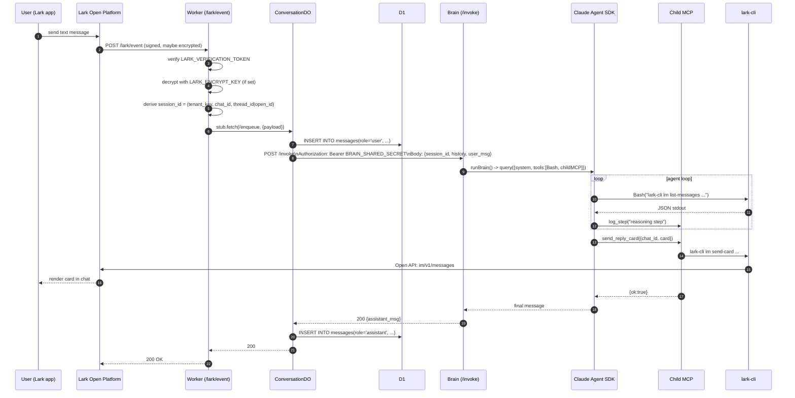

# シーケンス: スマートフォン → Lark ボット → カード返信

このドキュメントでは、クラウド経路における 1 ターンの流れを解説します。すなわち、
ユーザーがスマートフォンから Lark ボットにメッセージを入力し、返信カードが返って
くるまでの流れです。静的なアーキテクチャについては
`docs/architecture/overview.md` を参照してください。

## 登場要素

- **User / Lark client** — スマートフォンアプリ
- **Lark Open Platform** — メッセージのルーティングおよび署名生成
- **Worker** — `apps/webhook`、Cloudflare 上の Hono
- **DO** — Worker 内の `ConversationDO`、`session_id` ごとに 1 インスタンス
- **D1** — `apps/webhook/migrations/0001_init.sql`
- **Brain** — `apps/brain`、Hono コンテナ、`POST /invoke`
- **Claude Agent SDK** — ブレイン内の `@anthropic-ai/claude-agent-sdk` `query()`
- **Child MCP** — `apps/brain/dist/tools/mcp-server.js` (`send_reply_text`、
  `send_reply_card`、`log_step`)
- **lark-cli** — `@larksuite/cli`、ブレインのイメージにグローバルインストール済み

## Mermaid シーケンス

## ステップごとの補足

1. **署名検証** — Worker は `LARK_VERIFICATION_TOKEN` を用いて
   `timestamp + nonce + body` に対して HMAC を計算し、不一致のものは拒否します。
   `LARK_ENCRYPT_KEY` が設定されている場合、内側の `encrypt` フィールドを JSON
   パースの前に AES 復号します。

2. **イベントタイプによるルーティング** — `url_verification` はインラインで
   challenge を返します。`im.message.receive_v1` は DO 経路に進みます。カード
   アクションは `/lark/card-action` に到達し、短縮版のバリアント（同じ DO、
   単純な ack ではブレイン呼び出しなし）に従います。

3. **DO エンキュー** — Worker は
   `env.CONVERSATION.idFromName(session_id)` で DO を選択します。DO はその会話の
   唯一のライターであるため、同じスレッドで連続して送られた 2 つのメッセージは、
   明示的なロックなしに自然に直列化されます。

4. **DO 永続化** — DO 内では、ブレインを呼び出す前にユーザーメッセージを D1 の
   `messages` テーブルへ追記します。これにより、ブレイン呼び出しが失敗しても
   監査証跡が確実に残ります。

5. **ブレイン呼び出し** — `BRAIN_URL` への `POST /invoke` を
   `Authorization: Bearer BRAIN_SHARED_SECRET` 付きで実行します。ボディには
   トリム済みの履歴と新しいユーザーメッセージが含まれます。Worker は Lark への
   *最終* 返信は待ちません。ブレインは lark-cli 経由で返信カードの送信に成功した
   時点で応答を返します。

6. **エージェントループ** — `runBrain()` 内で、Lark 専用のシステムプロンプト、
   （プロンプトポリシーにより `lark-cli` に制約された）`Bash` ツール、および
   3 ツールの子 MCP とともに Claude Agent SDK の `query()` が呼ばれます。SDK は
   モデルが最終返信を出力し `send_reply_text` または `send_reply_card` を
   呼ぶまで tool-use ループを駆動します。

7. **返信の配信** — `send_reply_card` は `lark-cli im send-card` を実行し、
   Lark Open API の `im/v1/messages` を叩きます。lark-cli はボットトークンを
   保持しているため、ボットが既にメンバーであるチャットに返信する場合はユーザー
   単位の OAuth は不要です。

8. **アシスタントメッセージの永続化** — ブレインが ack した後、DO はアシスタント
   メッセージを D1 に書き込み、応答を返します。Worker は Lark に 200 を返します。

## タイムアウトと障害モード

- **Worker → DO**: プロセス内なので、実質的に即時です。
- **DO → Brain**: Worker のサブリクエストタイムアウトに律速されます。ブレインが
  遅い場合、DO は子 MCP 経由で中間的な `send_reply_text("Thinking…")` を送るべき
  です。(これは最適化です。MVP ではブレインが高速であるか、先に中間 ack を返す
  ことに頼って 3 秒以内に Lark へ ack します。)
- **Brain → lark-cli**: `LARK_CLI_BIN` プロセスのライフタイムに律速されます。
  長時間ツール（例: 大きな検索）はエージェントレベルで分割すべきです。
- **冪等性**: Lark は 5xx 応答時にイベントを再送します。DO は
  `session_id + event_id` で重複排除します。重複イベントはブレイン呼び出しの
  前に短絡されます。

## 関連ドキュメント

- `docs/architecture/overview.md`
- `docs/architecture/data-model.md`
- `docs/architecture/security.md`
